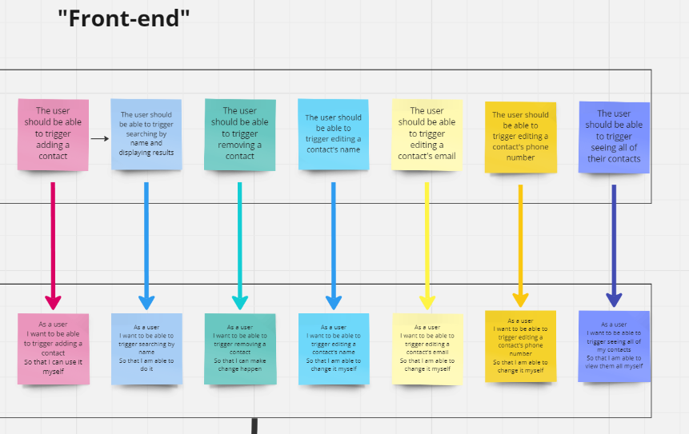

# Domain Models, Class Diagrams and Test Plan

### Kanban board showing overall breakdown of tasks to be completed.
;

### Client requirements converted into user stories.

### Each user story then has a corresponding domain model showing the properties, messages and output required for the specific functionality to be implemented.

### Kanban board for setting out the tests to be used during the test-driven development of the software.

### Full details of the tests for each user story:
*User Story 1:*
As a user
I want to be able to add a contact
So that I can not forget my friends' contact details

ContactListManager Tests:
* Test that when I add a contact to the ContactListManager, the length of the contact list increases by 1.
* Test that when I add a contact to the ContactListManager, the contact list includes the added contact
* Test that a null object throws IllegalArgumentException
* Test that I can add a contact if there is already a contact in the list

*User Story 2:*
* As a user
* I want to be able to my contact to have a name
* So I know who it is

Contact tests:
* Test that when I pass a name into the constructor of a contact, the resulting contact has the same
* Test that passing an empty string as the name throws IllegalArgumentException
* Test that passing null as the name throws an Illegal Argument Exception

Details Validator tests:
* Test that an empty string in validateName() returns false
* Test that null in validateName() returns false
* Test that a string with characters in it returns true

*User Story 3:*
* As a user
* I want my contact to have a phone number
* So I know how to call them

Contact Tests:
* Test that when I pass a phone number into the constructor of a contact, the resulting contact has the same
* Test that passing an empty string as the phone number throws IllegalArgumentException
* Test that passing a string with alphabetical characters as the phone  number throws IllegalArgumentException
* Test that passing a string with special characters as the phone number throws IllegalArgumentException
* Test that passing a string that doesn't have exactly 11 non-whitespace digits as the phone number throws IllegalArgumentException
* Test that a valid number but with additional whitespace in the string does not throw IllegalArgumentException
* Test that passing a string that doesn't begin with 07 as the phone number throws IllegalArgumentException

DetailsValidator Tests:
* Test that passing an empty string in validatePhone() returns false
* Test that a string with alphabetical characters in validatePhone() returns false
* Test that a string with punctuation characters in validatePhone() returns false
* Test that a string that is not exactly 11 non-whitespace digits returns false
* Test that a string with 11 non-whitespace digits but also whitespace digits returns true
* Test that a string whose first two non-whitespace digits aren't 07 returns false

*User Story 4:*
As a user
I want my contact to have an email address
So I know how to email them

Contact Tests:
* Test that when I pass a valid email address into the contact, the resulting contact has the same
* Test that passing in an invalid email string returns IllegalArgumentException

Details Validator tests
* Test that a string without an '@' symbol returns false
* Test that a string with no content before the @ symbol returns false
* Test that a string with whitespace anywhere other than the front or end returns false
* Test that a string without '.' after the @ symbol returns false
* Test that a string with '.' immediately after the @ symbol returns false

*User Story 5:*
As a user
I want to be able to search my address book by name and see the results
So that I can find contact details of my friend

Contact Tests:
* Test that when I pass a valid email address into the contact, the resulting contact has the same
* Test that passing in an invalid email string returns IllegalArgumentException

Details Validator tests
* Test that a string without an '@' symbol returns false
* Test that a string with no content before the @ symbol returns false
* Test that a string with whitespace anywhere other than the front or end returns false
* Test that a string without '.' after the @ symbol returns false
* Test that a string with '.' immediately after the @ symbol returns false

*User Story 6:*
As a user
I want to be able to remove a contact from the address book
So that I can remove people from my life

ContactListManager Tests:
* Test that when a contact is removed, the contactList length reduces by 1
* Test that when a contact is removed, the contactList no longer includes that contact
* Test that when there are multiple contacts in the list, only one contact is removed
* Test that removing a null contact throws IllegalArgumentException

*User Story 7:*
As a user
I want to be able to edit a contact's details
So that I can keep up with their changing lives

Contact Tests:
* Test that when I change the contact's name to a valid name, the resulting name is as expected
* Test that setting an invalid name throws IllegalArgumentException
* Test that when I change the contact's phone number, the resulting number is as expected
* Test that setting an invalid phone throws IllegalArgumentException
* Test that when I change the contact's email address, the resulting email address is as expected
* Test that setting an invalid email throws IllegalArgumentException

ContactListManager tests:
* Test that when using editContactName is called,setName is called on the contact with the given name
* Test that editContactName throws IllegalArgumentException if Contact passed in is not in the CLM's contact list
* Test that when using editContactPhone is called, setPhone is called on the contact with the given phone
* Test that editContactPhone throws IllegalArgumentException if Contact passed in is not in the CLM's contact list
* Test that when using editContactEmail is called, setEmail is called on the contact with the given email
* Test that editContactEmail throws IllegalArgumentException if Contact passed in is not in the CLM's contact list

*User Story 8:*
As a user
I want to be unable to add a contact with the same phone number as another contact
As that doesn't make sense

ContactListManager Tests:
* Test that when a phone number in checkPhoneNotTaken matches a contact in the contactList, throws IllegalArgumentException
* Test that when a phone number in checkPhoneNotTaken doesn't match a contact in the contactList, doesn't throw IllegalArgumentException
* Test that a contact in addContact() with a phone matching another contact returns an IllegalArgumentException
* Test that passing a contact in addContact with a phone matching another contact, doesn't increase contact list length

*User Story 9:*
As a user
I want to be unable to edit a contact to have the same phone number as another contact
As that doesn't make sense

ContactListManagerTests:
* Test that editContactPhone throws IllegalArgumentException if new phone matches already existing contact's phone

*User Story 10:*
As a user
I want to be unable to add a contact with the same email address as another contact
As that doesn't make sense

ContactListManager Tests:
* Test that when an email in checkEmailNotTaken matches a contact in the contactList, throws IllegalArgumentException
* Test that when an email in checkEmailNotTaken doesn't match a contact in the contactList, doesn't throw IllegalArgumentException
* Test that a contact in addContact() with an email matching another contact returns an IllegalArgumentException
* Test that passing a contact in addContact with a email matching another contact, doesn't increase contact list length

*User Story 11:*
As a user
I want to be unable to edit a contact to have the same phone number as another contact
As that doesn't make sense

ContactListManagerTests:
* Test that editContactEmail throws IllegalArgumentException if new email matches already existing contact's email

*User Story 12:*
As a user
I want to be able to view all of my contacts at once
So I can see how popular I am

No new tests needed

*User Story 13:*
As a user
I want to be able to trigger adding a contact
So that I can use it myself

InputValidatorTests:
* Test validateIntInRange throws illegalArgumentException if userChoice is above maxChoice
* Test validateIntInRange throws illegalArgumentException if userChoice is below minChoice
* Test validateIntInRange doesn't throw exception if user choice is equal to max choice
* Test validateIntInRange doesn't throw exception if user choice is equal to min choice
* Test validateIntInRange doesn't throw exception if user choice is strictly between min and max choice

UserInputMenu tests:
* Test takeUserNumberChoice returns input when input is valid
* Test takeUserNumberChoice returns second input when first input is invalid but second is valid
* Test takeUserNumberChoice throws Exception when input is a non integer
* Test takeContactDetailsFromUser returns expected Array

AddressBook tests
* Test after performing actOnUserChoice with valid contact details, AB's CLM length increases by 1
* Test actOnUserChoice with invalid details, AB's CLM length stays the same

*User Story 14:*
As a user
I want to be able to trigger searching by name
So that I am able to do it

UserInputMenu tests:
* takeStringWithPrompt returns inputted string

AddressBook tests:
* actOnUserChoice() with a valid search calls displayContactsToUser

*User Story 15:*
As a user
I want to be able to trigger removing a contact
So that I can make change happen

AddressBook tests
* Test that removing a contact using actOnUserChoice successfully reduces the contact list's length by one

*User Story 16:*
As a user
I want to be able to trigger editing a contact's name
So that I am able to change it myself

AddressBook tests:
* Test that actOnUserInput, with correct inputs and a valid new name, results in the contact having the expected name

*User Story 17:*
As a user
I want to be able to trigger editing a contact's email
So that I am able to change it myself

AddressBook tests:
* Test that actOnUserInput, with correct inputs and a valid new email, results in the contact having the expected email

*User Story 18:*
As a user
I want to be able to trigger editing a contact's phone number
So that I am able to change it myself

AddressBook tests:
* Test that actOnUserInput, with correct inputs and a valid new phone number, results in the contact having the expected phone number

*User Story 19:*
As a user
I want to be able to trigger seeing all of my contacts
So that I am able to view them all myself

No new tests needed

